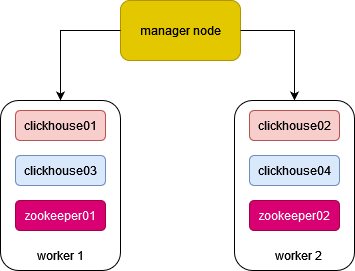

# AlienSwarm(异星蜂群)
AlienSwarm is a toolset to build *clickhouse* data cluster. You can freely choose your shard number 
and zookeeper number, the toolset will generate all the infrastructures for you.

## 1. requirments:
* python > 3.8
* docker desktop(Windows, Macos, Linux) and docker runtime
* docker hub account (if you do not have, quick register one!)
* three node(bare metal or virtual) which each member can ping with each other

## 2. infrastructure build:
In this article, we will build a three node clickhouse cluster(1 manager, 2 worker). The manager node will distribute
4 clickhouse containers(2 shards, 2 replicas each shard) to worker nodes. Also, the manager will distribute 2 zookeeper
containers to work nodes. The structure of the cluster is:

