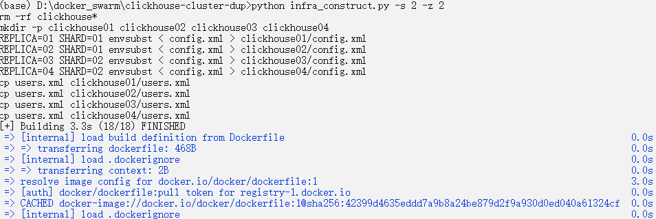
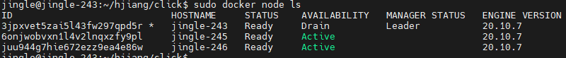

# AlienSwarm(异星蜂群)
AlienSwarm is a toolset to build *clickhouse* data cluster. You can freely choose your shard number 
and zookeeper number, the toolset will generate all the infrastructures for you.

## 1.requirments:
* python > 3.8
* docker desktop(Windows, Macos, Linux) and docker runtime
* docker hub account (if you do not have, quick register one!)
* three node(bare metal or virtual) which each member can ping with each other and have docker installed!

## 2.cluster topology:
In this article, we will build a three node clickhouse cluster(1 manager, 2 worker). The manager node will distribute
4 clickhouse containers(2 shards, 2 replicas each shard) to worker nodes. Also, the manager will distribute 2 zookeeper
containers to work nodes. The structure of the cluster is:


Wow! The privious picture just captures a state of the cluster, the real cluster may present some different topological structure.

## 3.infra construct:
The *infra_construct.py* script do the following tasks:
* build out clickhouse images and push to docker hub;
* gen *docker-compose.yml* for docker swarm;

run the following command:
```bash
python infra_construct.py -s 2 -z 2
```
1. -s: shard number
2. -z: zookeeper number

The following is a snapshot of the command: 


Now, check the result:
### 3.1 docker-compose.yml:
If the script running finish and no error occur during the process, a *docker-composer.yml* will be generated in 
the working directory. 
```
version: "3.8"
services:
  zookeeper01:
    image: bitnami/zookeeper:latest
    environment:
      - ZOO_SERVER_ID=1
      - ALLOW_ANONYMOUS_LOGIN=yes
      - ZOO_SERVERS=0.0.0.0:2888:3888,zookeeper02:2888:3888
    networks:
      clickhouse-network:
        ipv4_address: 172.23.0.10

  zookeeper02:
    image: bitnami/zookeeper:latest
    environment:
      - ZOO_SERVER_ID=2
      - ALLOW_ANONYMOUS_LOGIN=yes
      - ZOO_SERVERS=zookeeper01:2888:3888,0.0.0.0:2888:3888
    networks:
      clickhouse-network:
        ipv4_address: 172.23.0.11

  clickhouse01:
    image: redmagic039/clickhouse01:latest
    hostname: clickhouse01
    networks:
      clickhouse-network:
        ipv4_address: 172.23.0.12
    ports:
      - "127.0.0.1:8123:8123"
      - "127.0.0.1:9000:9000"
    depends_on:
      - zookeeper01
      - zookeeper02

  clickhouse02:
    image: redmagic039/clickhouse02:latest
    hostname: clickhouse02
    networks:
      clickhouse-network:
        ipv4_address: 172.23.0.13
    depends_on:
      - zookeeper01
      - zookeeper02

  clickhouse03:
    image: redmagic039/clickhouse03:latest
    hostname: clickhouse03
    networks:
      clickhouse-network:
        ipv4_address: 172.23.0.14
    depends_on:
      - zookeeper01
      - zookeeper02

  clickhouse04:
    image: redmagic039/clickhouse04:latest
    hostname: clickhouse04
    networks:
      clickhouse-network:
        ipv4_address: 172.23.0.15    
    depends_on:
      - zookeeper01
      - zookeeper02

networks:
  clickhouse-network:
    name: clickhouse-network
    ipam:
      config:
        - subnet: 172.23.0.0/24
```

### 3.2 config.xml for clickhouse
Check config.xml in one of the *clickhouse0x* dir, you will find the fillowing xml configs.
There are all messages about the cluster. Want to know the meaning behind them？ Check this:

https://clickhouse.com/docs/en/getting-started/tutorial/
```
    <remote_servers>
        <clickhouse_cluster>
            <shard>
                <replica>
                    <host>clickhouse01</host>
                    <port>9000</port>
                    <user>admin</user>
                    <password>Life123</password>
                </replica>
                <replica>
                    <host>clickhouse02</host>
                    <port>9000</port>
                    <user>admin</user>
                    <password>Life123</password>
                </replica>
            </shard>
            <shard>
                <replica>
                    <host>clickhouse03</host>
                    <port>9000</port>
                    <user>admin</user>
                    <password>Life123</password>
                </replica>
                <replica>
                    <host>clickhouse04</host>
                    <port>9000</port>
                    <user>admin</user>
                    <password>Life123</password>
                </replica>
            </shard>
        </clickhouse_cluster>
    </remote_servers>

    <zookeeper>
        <node index="1">
            <host>zookeeper01</host>
            <port>2181</port>
        </node>
        <node index="2">
            <host>zookeeper02</host>
            <port>2181</port>
        </node>
    </zookeeper>

    <macros>
        <cluster>clickhouse_cluster</cluster>
        <shard>01</shard>
        <replica>clickhouse01</replica>
    </macros>
```

### 3.3 docker iamges:
The script will build and push clickhouse images to docker hub. Now check them:

Yeah! Now we can use the docker images any where(Just make sure you can connect the Internet!).

## 4.oh! the cluster:
### 4.1 make a swarm:
You can check another article about how to create a swarm and put some services on it:

https://mjcjiang.github.io/2021/12/14/a-simple-taste-of-docker-swarm.html

I just give a snapshot of my swarm:


* jingle-243 is manager, *Drain* tell that no task will be allocated for him.
* jingle-245 and jingle-246 is work node, *Active* tell that tasks can be allocated for them.
* all docker engine's version is 20.10.7, which is the latest when i write this article.
